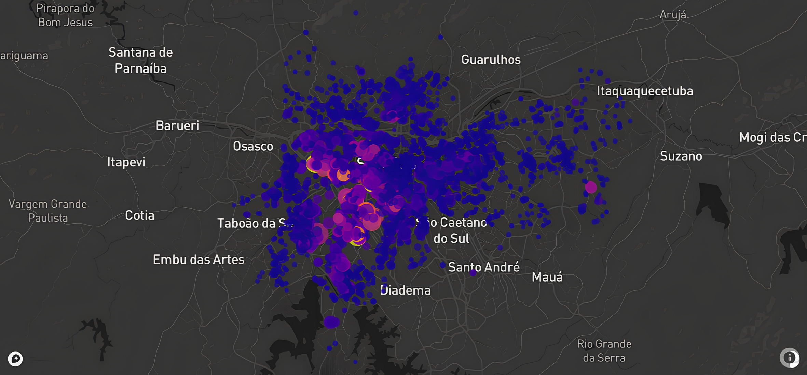

# Projeto de Machine Learning 🔬
## Previsão de Preço
A ideia principal é criar um sistema de aprendizado de máquina usando modelo de regressão para predizer os valores de aluguel. Levando em consideração vários aspectos importantes, como localização, tamanho, comodidades e outras características do imóvel.

📎 Conjunto de dados: https://bit.ly/dataset-imoveis 

### Notebook 1
No primeiro caderno, explorei e tive o primeiro contato com o conjunto de dados. Realizei a limpeza dos dados, identificando duplicatas, valores ausentes e removendo algumas variáveis desnecessárias para o andamento do projeto. Como os dados se referem a imóveis e o dataset contém variáveis de localização, como latitude e longitude, plotei um gráfico para visualizar a localização de cada unidade amostral em um mapa real. Isso revelou a presença de dados fora da Grande São Paulo. Diante dessas inconsistências, foi necessária uma nova etapa de limpeza para corrigir e ajustar os dados.

Em seguida, realizei uma análise exploratória dos dados, examinando-os sob a perspectiva estatística. Utilizei medidas de posição e dispersão, além de gráficos e outras ferramentas disponíveis, para entender melhor a distribuição e o comportamento dos dados.

